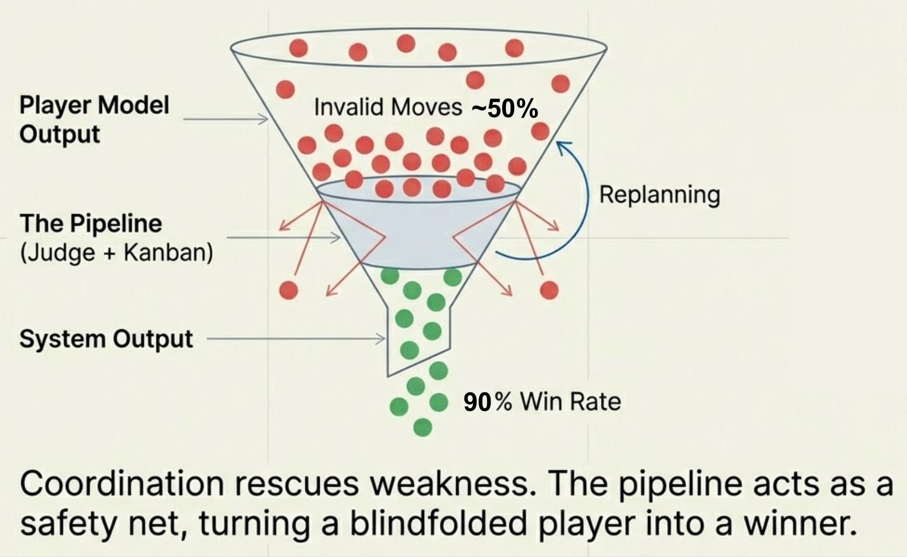

# MicroGPT-C

### What if AI didn't need a data centre?

What if you could train a model on a $5 chip — and what if *teams* of those tiny models could do things none of them could do alone?

That's the question behind MicroGPT-C.

> 📄 [The Stem Cell Philosophy](VISION.md) · 💡 [Why This Matters](VALUE_PROPOSITION.md) · 🗺️ [Roadmap](ROADMAP.md) · 📖 [Technical Guide](docs/book/0.md)

---

## The Idea

Large language models like GPT-4 are **generalist monoliths** — one enormous model that knows everything and requires a warehouse of GPUs to run. MicroGPT-C takes the opposite approach:

**Build tiny specialist models that each do one thing perfectly, then wire them together.**

We call them **organelles** — like the specialised structures inside a biological cell. Each organelle starts as the same blank "stem cell" (a minimal C99 Transformer), then *differentiates* based on the data you train it on:

```
Same engine + Name corpus    →  Name generator         (4K params, trains in < 1s)
Same engine + Shakespeare    →  Text generator          (840K params, zero unknown tokens)
Same engine + C functions    →  Code retrieval engine   (875K params, byte-perfect recall)
Same engine + Puzzle moves   →  Game solver             (64K params each, 3 models cooperate)
```

The breakthrough isn't any single model — it's what happens when they **work together**:

```
   "solve this 8-puzzle"
          │
          ▼
   ┌─────────────┐     ┌─────────────┐     ┌─────────────┐
   │  PLANNER     │ ──→ │  MOVER      │ ──→ │  JUDGE      │
   │  picks the   │     │  executes   │     │  checks if  │
   │  direction   │     │  the slide  │     │  it's valid │
   └─────────────┘     └─────────────┘     └─────────────┘
                                                  │
                                        ┌─────────┘
                                        ▼
                                  90% win rate
                                  (Connect-4 vs random)
```

A single model of the same size wins ~55%. Two models cooperating through a shared kanban protocol hit **90%**. The coordination is the intelligence.

---

## What Does This Mean For You?

| If you are... | MicroGPT-C gives you... |
|---------------|------------------------|
| **A developer** | A complete GPT in two C files (`microgpt.h` + `microgpt.c`). Drop them into any project. No Python, no Docker, no GPU cluster. Train and run models in the same binary. |
| **An embedded engineer** | AI that fits in < 50 KB RAM. No OS required. Runs on ESP32, STM32, or any chip with a C compiler. Models train on-device in seconds, not hours. |
| **A product owner** | Eliminate the $36K–$365K/year "API tax" of cloud AI. Your models, your weights, your device. Works offline. MIT licensed. |
| **A researcher** | An auditable Transformer in ~2,700 lines of commented C. No autograd black box — every gradient is computed by hand. Perfect for experimenting with attention variants, quantisation, or custom optimisers. |
| **A student** | The *entire* GPT algorithm — attention, backprop, Adam — in code you can read top to bottom in an afternoon. Five working experiments to learn from. |

---

## Proven Results

These aren't aspirational claims — every experiment below has run to completion with measured results:

| Experiment | What It Proves | Key Result |
|-----------|---------------|-----------|
| [Name Generation](demos/character-level/names/) | A 4K-param model invents plausible names | Trains in **< 1 second** |
| [Shakespeare](demos/character-level/shakespeare/) | 840K params learns spelling, verse, punctuation | **Zero** unknown tokens |
| [C Code Generation](experiments/organelles/c_codegen/) | Byte-perfect recall of 2,081 C functions | **0/10** on novel composition |
| [8-Puzzle Pipeline](experiments/organelles/puzzle8/) | 5 organelles coordinate via kanban protocol | **60%** solve rate (100% easy, 50% med, 30% hard) |
| [Tic-Tac-Toe Pipeline](experiments/organelles/tictactoe/) | Planner→Player pipeline with kanban | **90%** win+draw vs random |
| [Connect-4 Pipeline](experiments/organelles/connect4/) | System coordination rescues a weak model | **90%** wins vs random |

> The code generation result is the most telling: one model is a **perfect librarian** but a **terrible inventor**. That's exactly why organelle pipelines exist — a planner decomposes the problem, a retrieval engine finds the pieces, and a judge validates the output. Composition beats capacity. All game experiments share a [generic organelle library](src/microgpt_organelle.h) for training, inference, and kanban coordination.

### 🏆 Organelle Game Leaderboard

Eleven organelle demos — each a Planner→Player→Judge pipeline — tested across puzzles, strategy games, and code synthesis. Parameters were **right-sized** from the original 460K to match each game's corpus complexity (30K–160K), proving that smaller models often perform *better*.

| Rank | Game | Params | Result | Corpus | Tier | Δ vs 460K |
|:----:|------|-------:|-------:|-------:|------|:---------:|
| 🥇 | [**Pentago**](experiments/organelles/pentago/) | 92K | **91% win** | 3,477 | Small | ✅ +1% |
| 🥈 | [**Connect-4**](experiments/organelles/connect4/) | 460K | **90% win** | 1,911 | Original | — |
| 🥉 | [**Tic-Tac-Toe**](experiments/organelles/tictactoe/) | 460K | **90% w+d** | 576 | Original | — |
| 4 | [**Mastermind**](experiments/organelles/mastermind/) | 92K | **79% solve** | 1,975 | Small | ↓ 7% |
| 5 | [**Sudoku**](experiments/organelles/sudoku/) | 160K | **78% solve** | 20,000 | Standard | ✅ +2% |
| 6 | [**Othello**](experiments/organelles/othello/) | 92K | **67% win** | 4,496 | Small | ✅ +11% |
| 7 | [**Klotski**](experiments/organelles/klotski/) | 30K | **62% solve** | 232 | Micro | ✅ +3% |
| 8 | [**8-Puzzle**](experiments/organelles/puzzle8/) | 460K | **60% solve** | 1,000 | Original | — |
| 9 | [**Red Donkey**](experiments/organelles/reddonkey/) | 30K | **12% solve** | 199 | Micro | ↓ 18% |
| 10 | [**Lights Out**](experiments/organelles/lightsout/) | 160K | **10% solve** | 15,000 | Standard | ↓ 2% |
| 11 | [**Hex**](experiments/organelles/hex/) | 92K | **4% win** | 4,981 | Small | ↓ 6% |

**Key finding:** 4 of 8 right-sized games **improved** with 65–93% fewer parameters. Over-parameterisation hurts when a tiny corpus can't fill the model's capacity — the model memorises noise instead of learning patterns.

> **Parameter tiers:** Micro (30K) for corpora < 500 · Small (92K) for 1K–5K · Standard (160K) for 5K+ · Original 3 games remain at 460K

### The Coordination Funnel



**Point:** A model that's wrong half the time still wins 90% of games when wrapped in a coordination pipeline.

**Picture:** It's like a chess player who keeps trying to move pieces off the board. Instead of training a better player you hire a referee who says "nope — try again." The player is still bad but the *system* is smart.

**Proof:** Connect-4's player organelle produces ~50% invalid moves. The kanban pipeline catches every one and replans — resulting in a 90% win rate against a random opponent.

**Push:** Don't build a bigger model. Build a pipeline that filters a small model's mistakes.

---

## Under the Hood

MicroGPT-C is a **production-quality implementation** of a GPT-2 Transformer in plain C99, based on [Karpathy's `microgpt.py`](https://gist.github.com/karpathy/8627fe009c40f57531cb18360106ce95):

- **Full training pipeline** — forward pass, backward pass, Adam optimiser with cosine LR + warmup
- **97 unit tests** covering every public API function (60 core + 37 organelle)
- **22 performance benchmarks** with measured throughput (17 core + 5 organelle)
- **Two tokenisation strategies** — character-level and word-level (with O(1) hash lookup)
- **Configurable precision** — `float` (default, 2× faster) or `double` via `-DMICROGPT_USE_FLOAT=OFF`
- **INT8 quantisation** support for memory-constrained devices
- **SIMD auto-vectorisation** enabled by default
- **Cross-platform multi-threaded training** with shared training helpers (`TrainWorker`, `train_worker_run`)

> **Zero dependencies means zero dependencies.** The core engine (`microgpt.h` + `microgpt.c`) requires nothing beyond a C99 compiler, `libc`, and `libm`. It compiles and runs on any platform — from a Raspberry Pi to a mainframe.
>
> The following are **opt-in platform accelerators** that you enable explicitly via CMake flags. They are never required:
>
> | Accelerator | Flag | Requires | When To Use |
> |------------|------|----------|-------------|
> | Metal GPU | `-DMICROGPT_METAL=ON` | macOS + Apple Silicon | Models with N_EMBD ≥ 512 |
> | BLAS | `-DMICROGPT_BLAS=ON` | Accelerate / OpenBLAS / MKL | Single-threaded inference |
>
> If you don't set these flags, you get pure C99 with compiler auto-vectorisation — which, at current model sizes, is actually the fastest option (see [Optimisation Strategies](docs/foundation/OPTIMISATION_STRATEGIES.md)).

---

## Quick Start

```bash
mkdir build && cd build
cmake ..
cmake --build . --config Release

# Character-level name generation (trains in < 1 second)
./names_demo

# Character-level Shakespeare generation (multi-threaded)
./shakespeare_demo

# C code generation (875K params, multi-threaded)
./c_codegen

# Multi-organelle experiments (11 games)
./puzzle8_demo       # 5-organelle 8-puzzle solver (60% solve rate)
./tictactoe_demo     # 2-organelle tic-tac-toe (90% win+draw)
./connect4_demo      # 2-organelle Connect-4 (90% wins)
./pentago_demo       # 2-organelle Pentago (91% wins, 92K params)
./mastermind_demo    # 2-organelle Mastermind (79% solve, 92K params)
./sudoku_demo        # 2-organelle Sudoku 4x4 (78% solve, 160K params)
./othello_demo       # 2-organelle Othello 6x6 (67% wins, 92K params)
./klotski_demo       # 2-organelle Klotski (62% solve, 30K params)
./reddonkey_demo     # 2-organelle Red Donkey (12% solve, 30K params)
./lightsout_demo     # 2-organelle Lights Out (10% solve, 160K params)
./hex_demo           # 2-organelle Hex 7x7 (4% wins, 92K params)

# Run unit tests (97 tests total)
./test_microgpt
./test_microgpt_organelle

# Run benchmarks (22 benchmarks total)
./bench_microgpt
./bench_microgpt_organelle

# Build with double precision (if needed for research)
cmake -DMICROGPT_USE_FLOAT=OFF ..
cmake --build . --config Release
```

---

## Pretrained Models

Three pretrained checkpoints ship in [`models/`](models/) — copy one into your `build/` directory and the demo skips training entirely.

> **Note:** Checkpoint files (`.ckpt`) are stored via [Git LFS](https://git-lfs.github.com/). After cloning, run `git lfs pull` to download them. If you don't need the pretrained weights, skip this step — the demos will train from scratch.

| Model | Params | Size | Trained On | Inference Speed |
|-------|--------|------|-----------|----------------|
| [`shakespeare.ckpt`](models/shakespeare.ckpt) | 840K | 9.6 MB | Complete works of Shakespeare | ~16,000 tok/s |
| [`c_codegen.ckpt`](models/c_codegen.ckpt) | 875K | 20 MB | 2,081 C functions | ~14,000 tok/s |
| [`c_wiringgen.ckpt`](models/c_wiringgen.ckpt) | 875K | 19.9 MB | C function compositions | ~14,000 tok/s |

```bash
# Skip training — go straight to inference
cp ../models/shakespeare.ckpt build/
cd build && ./shakespeare_demo
# → "loaded checkpoint 'shakespeare.ckpt' (trained 30000 steps) — skipping training"
```

> Each checkpoint includes model weights + Adam optimizer state (so you can resume training). See [models/README.md](models/README.md) for architecture specs, the checkpoint format, and how to load models from your own C code.

---

### Example Output — Name Generation

```
docs:32033 vocab:27 embd:16 heads:4
params:4192
step    1/1000 loss 3.4468
step  500/1000 loss 2.1334
step 1000/1000 loss 2.4463

Train: 0.12s
--- names ---
   1: sarey          6: kenian         11: gamaren
   2: canal          7: zaynna         12: aleliy
   3: aninan         8: sanari         13: rarian
   4: aniel          9: ararinn        14: jaylan
   5: kanana        10: amaria         15: mariah
```

### Example Output — Shakespeare Generation

Trained with `N_EMBD=128 N_LAYER=4 N_HEAD=8` (840K params, ~37 min on 12 threads):

```
--- generated Shakespeare (character-level) ---

[sample — seed: 'O']
O    That may one is the stand's hanget stronger,

[sample — seed: 'W']
Whe win O the Luce of my find lifest a stance,

[sample — seed: 'M']
M    Reposs you find in have to see a man; as all eyes him.

[sample — seed: 'H']
Hand her calas to the satime of she for hear.
```

---

## How It Works

A decoder-only Transformer following the GPT-2 design:

```
Input → Token Embedding + Position Embedding
      → RMSNorm
      → [Self-Attention (multi-head, causal) → Residual] × N_LAYER
      → [RMSNorm → MLP (fc1 → ReLU → fc2, 4× width) → Residual] × N_LAYER
      → Linear (lm_head) → Softmax → next-token probabilities
```

**Training** uses cross-entropy loss with the Adam optimiser and cosine learning-rate schedule (linear warmup → cosine decay). The entire forward + backward pass is implemented manually — no autograd, no computational graph.

All architecture parameters are compile-time constants (`#define` macros in `microgpt.h`). The hot inner loops read these directly for maximum compiler optimisation. Override via CMake `DEFINES` or `-D` flags:

| Parameter | Default | Override | Effect |
|-----------|---------|----------|--------|
| `N_EMBD` | 16 | `-DN_EMBD=128` | Embedding dimension |
| `N_HEAD` | 4 | `-DN_HEAD=8` | Attention heads |
| `N_LAYER` | 1 | `-DN_LAYER=4` | Transformer blocks |
| `BLOCK_SIZE` | 16 | `-DBLOCK_SIZE=256` | Maximum sequence length |
| `MLP_DIM` | 64 | `-DMLP_DIM=512` | MLP hidden dimension |
| `WARMUP_STEPS` | 100 | `-DWARMUP_STEPS=500` | LR warmup duration |
| `scalar_t` | `float` | `-DMICROGPT_USE_FLOAT=OFF` | Switch all weights/activations to `double` |

---

## Using as a Library

### Integration

Add two files to your project — no build system changes needed beyond compiling one extra `.c`:

```c
#include "microgpt.h"
```

### Character-Level Pipeline

Best for short text: names, codes, identifiers.

```c
MicrogptConfig cfg = microgpt_default_config();

Docs docs;
load_docs("names.txt", &docs, cfg.max_docs);  // Load line-separated training data

Vocab vocab;
build_vocab(&docs, &vocab);           // Build character vocabulary (auto-sized)

size_t ids[256];
size_t n = tokenize("alice", 5, &vocab, ids, 256);

Model *model = model_create(vocab.vocab_size, &cfg);
// ... train with forward_backward_one + adam_step ...
// ... or use TrainWorker + train_worker_run for multi-threaded batches ...
// ... generate with forward_inference + sample_token ...
model_free(model);
```

### Word-Level Pipeline

Best for prose, dialogue, poetry. Uses O(1) hash-based `word_to_id` lookup.

```c
size_t len;
char *text = load_file("shakespeare.txt", &len);

WordVocab wv;
build_word_vocab(text, len, 10000, &wv);  // Keep top 10,000 words

size_t ids[8192];
size_t n = tokenize_words(text, len, &wv, ids, 8192);

MicrogptConfig cfg = microgpt_default_config();
Model *model = model_create(wv.vocab_size, &cfg);
// ... train and generate ...
free_word_vocab(&wv);
model_free(model);
```

### Character-Level vs Word-Level — Which to Use?

Both tokenisation strategies are available, but they suit different model scales:

| Factor | Character-level | Word-level |
|--------|----------------|-----------|
| **Vocab size** | ~50–100 tokens | ~5,000–10,000+ tokens |
| **`<unk>` tokens** | **Zero** — every byte is in vocab | Common for rare words |
| **lm_head cost** | ~100 × N_EMBD ≈ tiny | ~10,000 × N_EMBD ≈ dominates model |
| **Training signal** | Every character seen thousands of times | Rare words get few examples |
| **Best for** | Small models (\< 1M params) | Large models (millions of params) |

**Why character-level wins at this scale:** Shakespeare has ~20,000 unique words. Even keeping the top 8,000, the output layer (`lm_head`) alone would consume more parameters than the rest of the model combined. The model can't learn meaningful distinctions between thousands of words, so output floods with `<unk>`. With character-level (~84 tokens), the entire vocabulary fits comfortably and the model masters every symbol.

**Rule of thumb:** Use character-level unless your model has enough capacity (N_EMBD ≥ 256, N_LAYER ≥ 4) to handle a large word vocabulary.

### Training Checkpoints

Save and resume training without losing optimizer momentum:

```c
// Save: model weights + Adam m/v state + step counter
checkpoint_save(model, m_adam, v_adam, step, "checkpoint.bin");

// Resume: restores everything needed to continue training
MicrogptConfig cfg = microgpt_default_config();
Model *model = checkpoint_load("checkpoint.bin", vocab_size,
                               &cfg, m_adam, v_adam, &step);
// Continue training from 'step' onwards — momentum and LR schedule are preserved
```

### Multi-Threaded Training Helpers

The library provides shared training infrastructure so demos don't need to duplicate boilerplate:

```c
#include "microgpt.h"

// TrainWorker struct holds per-thread state (grads, KV cache, loss, positions)
TrainWorker workers[N_THREADS];
// Set workers[t].model, .docs, .vocab, .batch_start, .batch_end, etc.

// Spawn threads with the shared entry point
for (int t = 0; t < nthreads; t++)
    pthread_create(&threads[t], NULL, train_worker_run, &workers[t]);
for (int t = 0; t < nthreads; t++)
    pthread_join(threads[t], NULL);

// Aggregate: workers[t].loss, workers[t].positions, workers[t].grads
```

Also available: `shuffle_docs(&docs)` for Fisher-Yates document shuffling and `rand_u()` for uniform random `scalar_t` in [0, 1).

### Complete Examples

See [`demos/character-level/names/main.c`](demos/character-level/names/main.c) (character-level), [`demos/character-level/shakespeare/main.c`](demos/character-level/shakespeare/main.c) (character-level, multi-threaded), and [`experiments/organelles/c_codegen/main.c`](experiments/organelles/c_codegen/main.c) (875K-param C code generation) for full working programs.

Detailed guides:
- [Character-level tokenisation](docs/foundation/CHARACTER_LEVEL.md)
- [Word-level tokenisation](docs/foundation/WORD_LEVEL.md)

---

## Performance

### Character-Level vs Karpathy's microgpt.py

Measured on the **character-level name generation** workload (1,000 training steps, 20 inference samples) — MicroGPT-C vs [Karpathy's `microgpt.py`](https://gist.github.com/karpathy/8627fe009c40f57531cb18360106ce95):

| Metric | Python (microgpt.py) | C (fp64) | Speedup |
|--------|--------|----------|---------| 
| **Training time** | ~93 s | **0.09 s** | **~1,000×** |
| **Training throughput** | ~0.1 k tok/s | **~616 k tok/s** | **~6,000×** |
| **Steps/sec** | ~11 | **~10,800** | **~1,000×** |
| **Inference time** | ~0.74 s | **< 1 ms** | **~700×+** |

### Shakespeare Character-Level (N_EMBD=128, N_LAYER=4, vocab≈84)

Multi-threaded training with auto-detected workers (uses all available CPU cores):

| Metric | Value |
|--------|-------|
| **Model parameters** | ~1M |
| **Vocab** | ~84 characters (zero `<unk>`) |
| **Throughput** | ~85 steps/s, ~64k tok/s (12 threads) |

### Benchmarks (N_EMBD=16, N_LAYER=1)

Run `./bench_microgpt` to reproduce on your machine. Default build uses **float32**:

| Operation | float32 (default) | double64 | Speedup |
|---|---|---|---|
| `forward_backward_one` | **530k fwd+bwd/s** | 353k fwd+bwd/s | **1.50×** |
| `adam_step` | **646k steps/s** | 289k steps/s | **2.23×** |
| `sample_token` (vocab=50) | **6.8M samples/s** | 5.4M samples/s | **1.25×** |
| Full training step (seq=8) | **677k tok/s** | 536k tok/s | **1.26×** |
| `checkpoint_save` + `load` | **5,757 rt/s** | 4,846 rt/s | **1.19×** |
| `forward_inference` (1 tok) | 1,413k infer/s | 1,724k infer/s | ~1× (noise) |

**Matrix operations** (where precision matters most):

| Size | float32 | double64 | Speedup |
|---|---|---|---|
| 128×128 (N_EMBD) | **0.86 ms** | 1.90 ms | **2.21×** |
| 512×512 (future) | **17.93 ms** | 37.99 ms | **2.12×** |

**Memory footprint** (vocab=100):

| | float32 | double64 |
|---|---|---|
| Weights | 25.5 KB | 51.0 KB |
| Optimizer | 76.5 KB | 153.0 KB |
| **Total** | **104 KB** | **208 KB** |

> **Convergence:** Both precisions reach identical loss (0.0011 after 100 steps). Float32 is the recommended default — use `-DMICROGPT_USE_FLOAT=OFF` only if you need double-precision research comparisons.
>
> **INT8 quantised build:** ~25% slower training than float32 on this tiny model, but **~8× smaller** weight storage — ideal for constrained devices.

---

## Performance Optimisations

The engine includes several optimisations for training throughput:

- **`scalar_t` precision abstraction** — compile-time switch between `float` (default, 2× faster) and `double` via `-DMICROGPT_USE_FLOAT=OFF`; all math (`M_EXP`, `M_LOG`, etc.) and BLAS calls (`CBLAS_GEMV`, `CBLAS_GER`) auto-dispatch to the correct precision
- **Cache-friendly `lin_bwd`** — backward gradient accumulation uses row-major weight traversal, eliminating L1 cache thrashing for large output layers (e.g. lm_head with vocab=10003)
- **Hash-based `word_to_id`** — O(1) DJB2 hash lookup instead of O(n) linear scan across the vocabulary
- **Cosine LR with warmup** — linear warmup for `WARMUP_STEPS` followed by cosine annealing, avoiding premature LR decay
- **`restrict` + vectorisation hints** — C99 `restrict` qualifiers and Clang loop pragmas on all hot-path functions (`lin_fwd`, `lin_bwd`, `rmsnorm_fwd/bwd`) to enable full auto-vectorisation
- **Compiler flags** — `-O3 -ffast-math -march=native -flto -funroll-loops` for Release builds (LTO enables cross-file inlining)
- **Shared training helpers** — `TrainWorker` struct + `train_worker_run` thread entry, `shuffle_docs` — extracted from demos into the core library to eliminate duplication
- **Cross-platform multi-threaded batches** — all demos auto-detect CPU count and parallelise batch processing via the portable threading layer built into `microgpt.h` (pthread on Linux/macOS, Win32 threads on Windows)
- **Optional Metal GPU** — Apple Silicon GPU compute shaders for `lin_fwd`/`lin_bwd` matmuls via `-DMICROGPT_METAL=ON`
- **Optional BLAS** — Hardware-accelerated BLAS (Accelerate, OpenBLAS) for single-threaded inference via `-DMICROGPT_BLAS=ON`

---

## Build Options

### SIMD auto-vectorisation (ON by default)

The compiler targets the best available instruction set (`-march=native` on GCC/Clang, `/arch:AVX2` on MSVC). To disable:

```bash
cmake -DMICROGPT_SIMD=OFF ..
```

### INT8 quantised build

Weights stored as 8-bit integers with per-matrix scales:

```bash
cmake -DQUANTIZATION_INT8=ON ..
```

### Apple Metal GPU acceleration (macOS only)

Offloads `lin_fwd`/`lin_bwd` matmuls to Metal compute shaders. Best for larger models (N_EMBD ≥ 512):

```bash
cmake -DMICROGPT_METAL=ON ..
```

> **Note:** For small models (N_EMBD=128), GPU dispatch overhead exceeds compute time. Multi-threaded CPU is faster.

### Apple Accelerate / BLAS

Uses `CBLAS_GEMV`/`CBLAS_GER` macros (auto-dispatched to `cblas_dgemv`/`cblas_sgemv` based on `scalar_t`):

```bash
cmake -DMICROGPT_BLAS=ON ..
```

> **Note:** Accelerate's internal threading conflicts with multi-threaded training. Best for single-threaded inference.

### Float precision

Switch all weights, activations, and gradients from `double` to `float` (32-bit). Useful for ARM NEON throughput (4-wide vs 2-wide SIMD) and memory-constrained devices:

```bash
cmake -DMICROGPT_USE_FLOAT=ON ..
```

> **Note:** Optimizer hyperparameters (learning rate, Adam β1/β2/ε) remain `double` for numerical stability. Test tolerances auto-adjust via `SCALAR_TOL`.

### Custom architecture

Each demo uses the `DEFINES` parameter in CMakeLists.txt to set its architecture. For ad-hoc overrides:

```bash
cmake -DN_EMBD=128 -DN_HEAD=8 -DN_LAYER=4 -DBLOCK_SIZE=256 ..
```

> **Note:** All demos already have their optimal architecture sizes baked into `CMakeLists.txt` via `add_demo(... DEFINES ...)`. Manual overrides affect only the default library target.

---

## Project Layout

```
src/                                    FOUNDATION — Core engine
  microgpt.h                            Public API + portable threading (pthread / Win32)
  microgpt.c                            Core engine (~2,700 lines)
  microgpt_organelle.h                  Organelle Pipeline Architecture (OPA) library API
  microgpt_organelle.c                  OPA implementation (training, inference, kanban, cycle detection)
  microgpt_metal.h / .m / .metal        Metal GPU acceleration (optional)

demos/character-level/                  FOUNDATION — Core demos
  names/main.c                          Character-level name generation
  shakespeare/main.c                    Character-level Shakespeare (multi-threaded)

experiments/organelles/                 ORGANELLES — Multi-agent experiments (11 games)
  c_codegen/                            Single organelle: C code generation (875K params)
  c_wiringgen/                          Single organelle: C wiring generation
  puzzle8/                              Multi-organelle: 8-Puzzle (Planner + Mover + Judge)
  tictactoe/                            Multi-organelle: Tic-Tac-Toe (Planner + Player)
  connect4/                             Multi-organelle: Connect-4 (Planner + Player)
  pentago/                              Multi-organelle: Pentago — 91% win (92K params)
  mastermind/                           Multi-organelle: Mastermind — 79% solve (92K params)
  sudoku/                               Multi-organelle: Sudoku 4×4 — 78% solve (160K params)
  othello/                              Multi-organelle: Othello 6×6 — 67% win (92K params)
  klotski/                              Multi-organelle: Klotski — 62% solve (30K params)
  reddonkey/                            Multi-organelle: Red Donkey — 12% solve (30K params)
  lightsout/                            Multi-organelle: Lights Out — 10% solve (160K params)
  hex/                                  Multi-organelle: Hex 7×7 — 4% win (92K params)

models/                                 PRETRAINED — Ready-to-use checkpoints
  shakespeare.ckpt                      840K params, character-level Shakespeare
  c_codegen.ckpt                        875K params, C code generation
  c_wiringgen.ckpt                      875K params, C wiring generation

tests/
  test_microgpt.c                       Core unit tests (60 tests, zero dependencies)
  test_microgpt_organelle.c             OPA unit tests (37 tests)
  bench_microgpt.c                      Core benchmarks (17 benchmarks)
  bench_microgpt_organelle.c            OPA benchmarks (5 benchmarks)

docs/
  book/                                 Technical Guide — 14-chapter journal of the project
  foundation/                           Tokenisation guides, attention mechanisms, optimisation
  organelles/                           Pipeline design, planner architecture, CLI vision

tools/
  vocab_analysis.c                      Vocabulary coverage analysis utility

CMakeLists.txt                          Build system (C99, SIMD default ON, float32 default ON)
VISION.md                               Stem cell philosophy & composable intelligence whitepaper
ROADMAP.md                              Project roadmap (completed work + future directions)
CONTRIBUTING.md                         How to contribute (code style, PR process, ethics)
DATA_LICENSE.md                         Training data provenance & checkpoint licensing
```

---

## Requirements

- **C99 compiler** (GCC, Clang, MSVC)
- **CMake 3.10+**
- **pthreads** (Linux/macOS) or **Win32 threads** (Windows) — for multi-threaded demos
- No other dependencies
- **Optional:** [Git LFS](https://git-lfs.github.com/) — to download pretrained checkpoints (`git lfs pull`)
- **Optional:** Metal.framework + Foundation.framework (macOS, for `-DMICROGPT_METAL=ON`)
- **Optional:** Accelerate.framework / OpenBLAS / MKL (for `-DMICROGPT_BLAS=ON`)

---

## Responsible Use

MicroGPT-C runs entirely on-device with no telemetry, no cloud calls, and no data collection. This is a privacy feature — but it also means there are no external safety guardrails. We ask users to consider:

### Bias & Fairness

Small models trained on narrow corpora **inherit the biases of that corpus**. A name generator trained on English names will not generate Chinese names. A code generator trained on C will not produce Python. This is by design — but be aware of it when deploying organelles in contexts where representation matters.

### Confidence ≠ Correctness

Organelles report confidence scores via softmax entropy. High confidence means the model has seen similar patterns — **not** that the output is factually correct. Always validate organelle output through deterministic checks (the Judge pattern) or human review for safety-critical applications.

### Recommended Safeguards

| Risk | Mitigation |
|------|------------|
| Model produces harmful content | Train on curated corpora; add a Judge organelle for output filtering |
| Model is overconfident on novel input | Use confidence gating: reject outputs below threshold |
| Training data contains PII | Keep training data local; use synthetic or anonymised corpora |
| Model drifts after incremental training | Maintain replay buffers; periodically retrain from scratch |

### Adoption & Language Bindings

MicroGPT-C is pure C99 by design — this maximises portability but limits ecosystem reach. We recognise this tradeoff:

- **Python/JS wrappers** are not yet available but are on the roadmap
- The two-file design (`microgpt.h` + `microgpt.c`) is deliberately easy to wrap via FFI, ctypes, or WASM
- Contributions of language bindings are welcome — see [CONTRIBUTING.md](CONTRIBUTING.md)

---

## License

MIT — see [LICENSE](LICENSE) and source file headers.

For training data provenance, checkpoint licensing, and contribution data requirements, see [DATA_LICENSE.md](DATA_LICENSE.md).

**Author:** Ajay Soni (ajay.soni@enjector.com), Enjector Software Ltd.
