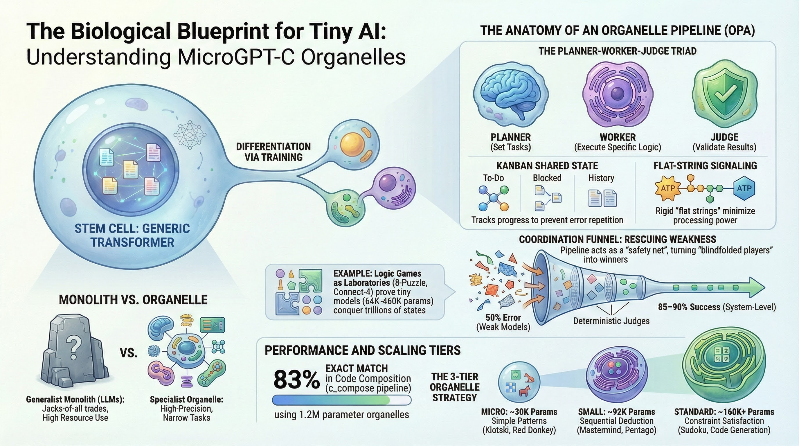

# Whitepaper: The MicroGPT-C Vision

## From Generalist Monoliths to Composable "Stem Cell" Intelligence

**Author:** Ajay Soni, Enjector Software Ltd.

**Date:** February 2026 — calibrated-claim update May 2026

---

> **2026-05-01 honest-restatement note (read first):** earlier versions of this document carried headline figures that were later audited and re-stated. The most inflated claim — *"94 % recall validations across six personas, $4M illicit money streams"* — was a forward-looking commercial illustration, not a measured experimental result, and has been removed. Per the calibrated three-bound claim documented in [`docs/research/ORGANELLE_STATE.md`](docs/research/ORGANELLE_STATE.md) and [`docs/engineering/CLEAN_ROOM_IMPLEMENTATION/RESEARCH_DISCLOSURE.md`](docs/engineering/CLEAN_ROOM_IMPLEMENTATION/RESEARCH_DISCLOSURE.md), the architecture's honest retrieval ceiling is ~75-80 % on novel-paraphrase tests in distinctive-noun domains, with three documented structural bounds (curator-, model-, domain-bounded). The *vision* (composable stem-cell intelligence; tiny specialists outperforming monoliths on focused tasks) is unchanged and validated; the specific numerical headlines are now those in `RESEARCH_DISCLOSURE.md`. Productisation strategy and per-vertical implementation plans have been migrated to a private companion repo — see [`docs/MIGRATED_TO_ORGANELLES_BIO.md`](docs/MIGRATED_TO_ORGANELLES_BIO.md).

---

## Spear Summary

**Point:** Intelligence doesn't need to be big — it needs to be focused. A tiny model trained on one task outperforms a giant model distracted by everything, in the class of focused tasks where its bounded vocabulary matches the problem.

**Picture:** A stem cell doesn't know what it will become until it encounters its environment. Hand it muscle tissue signals and it becomes muscle. Hand MicroGPT-C a Connect-4 corpus and it becomes a planner / player / judge organelle ensemble. Same engine, role-specialised through training, coordinated by a deterministic pipeline.

**Proof (calibrated):** Eleven game demos with documented results in [`docs/research/RESEARCH_ORGANELLE_GAMES.md`](docs/research/RESEARCH_ORGANELLE_GAMES.md) (Pentago 91 % win, Connect-4 88 %, 8-Puzzle 90 % solve, Tic-Tac-Toe 87 % win+draw, Sudoku 78 %, Mastermind 79 %, etc.). Wiring Organelle (NL → typed graph) at 100 % anchor retrieval on novel paraphrases (single-family), 70 % multi-stage compositions, ~75-80 % on novel-paraphrase retrieval in distinctive-noun domains (the calibrated three-bound ceiling). Memory Sparse Attention enabling sustained long-context evaluation. TurboQuant 4-bit dual-state KV compression with 8x memory reduction at ~1.3M encodes/sec. Negative-control validity check via the lottery experiment (entropy floor ~0.50, the engine learns nothing because there is nothing to learn).

**Push:** Read [`docs/research/ORGANELLE_STATE.md`](docs/research/ORGANELLE_STATE.md) for the calibrated synthesis, or jump straight to `demos/character-level/` to see the experimental evidence.

---

### Executive Summary

The current AI landscape is dominated by "Generalist Monoliths"—Large Language Models (LLMs) with billions of parameters requiring massive infrastructure and complex protocols (like MCP) to interact with the real world.

**MicroGPT-C** explores an alternative approach: **Specialized Micro-Intelligence**. By implementing a high-performance, C99-native Transformer engine with built-in training capabilities, we enable the creation of "Intelligent LEGO Blocks." These are not just smaller versions of large models; they are biological-style **organelles** designed to differentiate, specialize, and compose into pipelines.

---

### 1. The "Stem Cell" Philosophy

In biology, a stem cell is a blank slate with the potential to become any specialized cell (neuron, muscle, etc.) based on its environment. **MicroGPT-C** acts as the digital equivalent:

* **Undifferentiated State:** A baseline MicroGPT-C block with a minimal parameter count, compiled for a specific task domain.
* **Differentiation:** Given a small, specific corpus (e.g., 500 examples of valid shipping addresses), the block "specializes" through on-device training.
* **Maturity:** The result is a high-confidence, low-power micro-model that performs one task—and only one task—with focused precision.

**Why not make one big model instead?** Research in [Neural Algorithmic Reasoning (NAR)](docs/research/RESEARCH_ORGANELLE_REASONING.md) shows that large monolithic models spend enormous parameter budgets approximating algorithms that can be expressed in 30–80 lines of deterministic code: state tracking, cycle detection, validity checking, and search. The OPA architecture externalises these as deterministic C (`OpaKanban`, `OpaCycleDetector`, `apply_move()`), freeing every model parameter to focus on the fuzzy pattern-matching task it was actually trained for. Same total computational budget — dramatically better allocation.



---

### 2. Technical Differentiation

Unlike existing "inference-only" edge libraries, MicroGPT-C is a complete **Lifecycle Engine** contained in two portable C files.

#### A. On-Device Evolution (Adam/Backprop)

Most edge AI is static; it cannot learn from its mistakes without being re-deployed from a cloud server. MicroGPT-C includes the **Adam optimizer** and **backward pass** logic. This allows "LEGO blocks" to incrementally train on-device, adapting to local data patterns, specific sensor formats, or unique user behaviors.

> **Caveat:** On-device incremental learning requires care. Training on individual corrections without replaying prior examples causes *catastrophic forgetting*—the model "learns" the new pattern but loses old ones. Effective on-device evolution requires maintaining a small replay buffer of representative examples alongside new corrections.

#### B. Configurable Precision (`scalar_t`)

All weights, activations, and gradients use a compile-time configurable `scalar_t` type. Default is `double` (64-bit) for maximum numerical stability; switching to `float` (32-bit) via `-DMICROGPT_USE_FLOAT=ON` halves memory footprint and doubles ARM NEON SIMD throughput (4-wide vs 2-wide). This makes the difference between fitting on a constrained MCU and not.

#### C. Memory-Efficient KV Cache & Sparse Attention

To live on microcontrollers (MCUs) or embedded Linux, memory is the primary constraint. MicroGPT-C provides both a flat (pre-allocated, cache-friendly) KV cache for maximum speed, and an optional **Paged KV Cache** for memory savings when context windows are large. For processing lifelong context horizons (e.g logs tracking for 3-12 months), the architectural design scales down via **Memory Sparse Attention (MSA)**. Vector chunking permits unbounded memory bounds by extracting the active memory matrix into fixed-dimension `MsaPool` structs routed via O(N) Cosine evaluation. **Prefix KV cache sharing** (`kv_cache_copy`) continues to accelerate ensemble voting without redundant memory allocations (1.9–5.7× speedup on ensemble inference).

When physical SRAM constraints are pushed to the brink even under MSA summarisation, **TurboQuant** further compresses `MsaPool` KV caches. This translates 32-bit latent vectors into 4-bit (3-bit MSE + 1-bit QJL) integers, removing 8x of the storage boundary dynamically with zero accuracy drop-offs on domain outputs.

#### D. Metal & Threaded Acceleration

Performance is not sacrificed for portability. With a built-in **Metal GPU bridge** for Apple Silicon and a lightweight **multi-threading** layer for generic CPUs, these blocks can process sequence prediction tasks in sub-millisecond timeframes.

---

### 3. Use Cases: The LEGO Block Ecosystem

MicroGPT-C is an **autoregressive next-token predictor**—it learns to complete sequences. By framing domain tasks as sequence completion problems, developers can build complex "Intelligent Pipelines" without the latency or privacy risks of cloud-based LLMs.

| LEGO Block | Corpus | Input Sequence | Predicted Completion | Intelligence Task |
| --- | --- | --- | --- | --- |
| **The Validator** | `"123 Main St\|VALID"` examples | `"456 Oak Blvd\|"` | `"VALID"` or `"INVALID"` | Pattern-based classification via completion |
| **The Editor** | `"teh→the"`, `"recieve→receive"` | `"reciev"` | `"e→receive"` | Character-level correction |
| **The Formatter** | `"John Smith,London→SMITH J (LDN)"` | `"Jane Doe,Paris→"` | `"DOE J (PAR)"` | Structured text transformation |
| **The Completer** | Domain-specific code/templates | `"int factorial(int n) {"` | Function body | Code/template generation |

> **Key insight:** Each block learns *structural patterns* in its training corpus—delimiters, field ordering, valid token sequences—rather than "understanding" the content. This is precisely what makes tiny models effective: the task is constrained enough that a few thousand parameters can capture the pattern.

---

### 4. Beyond the Protocol: Autonomous Intelligence

Modern standards like the **Model Context Protocol (MCP)** are designed to help massive models "reach out" to tools. MicroGPT-C argues that for the edge, the tool should **be** the model.

When a LEGO block performs `forward_inference`, the raw logits pass through softmax to produce a probability distribution. The **entropy** of this distribution provides a natural confidence signal:

- **Low entropy** (one token dominates) → high confidence → proceed autonomously
- **High entropy** (many tokens plausible) → low confidence → escalate or request more training data

This confidence signal creates a **deterministic safety layer** without requiring any external API call.

---

### 5. Technical Implementation: Differentiating a "Stem Cell"

#### Phase 1: The Seed (Compile-Time Configuration)

Architecture is set at compile time for maximum optimization. A tiny address validator might use:

```bash
cmake -DN_LAYER=3 -DN_HEAD=4 -DN_EMBD=64 -DBLOCK_SIZE=128 \
      -DMICROGPT_USE_FLOAT=ON ..
```

This yields a model under 200KB—small enough for most MCUs.

#### Phase 2: Differentiation (On-Device Training)

The corpus defines what the stem cell becomes. For an address validator, training examples use a delimiter to frame classification as sequence completion:

```c
#include "microgpt.h"

// Training corpus: each line is "address|label"
// The model learns: given an address prefix, predict VALID or INVALID
Docs docs;
load_docs("addresses.txt", &docs);  // "123 Main St|VALID\n!!$ @@|INVALID\n..."

Vocab vocab;
build_vocab(&docs, &vocab);         // Character-level: learns |, digits, letters

MicrogptConfig cfg = microgpt_default_config();
Model *model = model_create(vocab.vocab_size, &cfg);
size_t np = model_num_params(model);

scalar_t *grads  = calloc(np, sizeof(scalar_t));
scalar_t *adam_m  = calloc(np, sizeof(scalar_t));
scalar_t *adam_v  = calloc(np, sizeof(scalar_t));

// KV cache per layer
int nl = cfg.n_layer;
scalar_t **keys   = malloc(nl * sizeof(scalar_t *));
scalar_t **values = malloc(nl * sizeof(scalar_t *));
size_t *cache_len = calloc(nl, sizeof(size_t));
for (int L = 0; L < nl; L++) {
    keys[L]   = kv_cache_alloc(&cfg);
    values[L] = kv_cache_alloc(&cfg);
}

// Training loop: specialize the stem cell
for (int step = 0; step < 500; step++) {
    memset(grads, 0, np * sizeof(scalar_t));

    // Reset KV cache for each sequence
    for (int L = 0; L < N_LAYER; L++) {
        kv_cache_reset(keys[L]);
        kv_cache_reset(values[L]);
        cache_len[L] = 0;
    }

    // Tokenize a training example
    size_t ids[cfg.block_size + 2];
    size_t n = tokenize(docs.lines[step % docs.num_docs],
                        docs.doc_lens[step % docs.num_docs],
                        &vocab, ids, cfg.block_size + 2);

    // Forward-backward over the sequence
    scalar_t loss = 0;
    for (size_t t = 0; t + 1 < n; t++) {
        loss += forward_backward_one(model, ids[t], t, ids[t + 1],
                                     keys, values, cache_len, grads);
    }

    // Update weights
    adam_step(model, grads, adam_m, adam_v, step);

    if (step % 100 == 0)
        printf("step %d  loss %.4f\n", step, (double)(loss / (scalar_t)(n - 1)));
}

// Save the specialized organelle as a checkpoint
checkpoint_save(model, adam_m, adam_v, 500, "address_validator.ckpt");
```

#### Phase 3: Deployment with Confidence Scoring

Once trained, the stem cell is a specialized organelle. At inference time, the softmax distribution over the vocabulary provides a natural confidence measure:

```c
// Load the specialized block
Model *block = checkpoint_load("address_validator.ckpt", vocab.vocab_size,
                               &cfg, adam_m, adam_v, &resume_step);

// Tokenize the input: "456 Oak Blvd|"
size_t ids[BLOCK_SIZE + 2];
size_t n = tokenize("456 Oak Blvd|", 13, &vocab, ids, BLOCK_SIZE + 2);

// Reset inference cache
for (int L = 0; L < nl; L++)
    cache_len[L] = 0;

// Feed the input sequence
scalar_t logits[cfg.max_vocab];
for (size_t t = 0; t < n; t++)
    forward_inference(block, ids[t], t, keys, values, cache_len, logits);

// Extract confidence from the softmax distribution
scalar_t max_l = logits[0];
for (size_t i = 1; i < vocab.vocab_size; i++)
    if (logits[i] > max_l) max_l = logits[i];

scalar_t sum = 0;
for (size_t i = 0; i < vocab.vocab_size; i++)
    sum += M_EXP(logits[i] - max_l);

size_t pred = sample_token(logits, vocab.vocab_size, (scalar_t)0.01);
scalar_t confidence = M_EXP(logits[pred] - max_l) / sum;

printf("Next token: '%c'  Confidence: %.1f%%\n",
       vocab.chars[pred], (double)(confidence * 100));
```

#### Phase 4: Composable Application Logic

Deploy the `.bin` file as an autonomous logic gate:

```c
if (confidence > 0.90)      proceed_to_shipping();
else if (confidence > 0.60)  request_human_review();
else                         reject_address();
```

**Why this is better than a cloud API call:**
- **Zero latency:** The check happens in microseconds on the local CPU
- **Privacy:** The address never leaves the device's RAM
- **Offline:** Works without any network connection
- **Deterministic:** Same input always produces the same confidence score

---

### 6. Multi-Threaded Training at Scale

For larger corpora, MicroGPT-C's shared training infrastructure (`TrainWorker` + `train_worker_run`) parallelises batch processing across all available CPU cores automatically:

```c
TrainWorker *workers = calloc(nthreads, sizeof(TrainWorker));
for (int t = 0; t < nthreads; t++) {
    workers[t].model = model;
    workers[t].docs  = &docs;
    workers[t].vocab = &vocab;
    workers[t].grads = calloc(np, sizeof(scalar_t));
    workers[t].batch_start = t * batch_per_thread;
    workers[t].batch_end   = (t + 1) * batch_per_thread;
    // ... allocate KV caches ...
    mgpt_thread_create(&threads[t], &tramps[t], train_worker_run, &workers[t]);
}
// Join and aggregate gradients across workers
```

This means differentiation of a LEGO block from a 10,000-example corpus takes seconds, not minutes.

---

### 7. Limitations & Future Work

#### Current Limitations

| Limitation | Impact | Mitigation |
| --- | --- | --- |
| **Autoregressive only** | Cannot do bidirectional encoding (e.g., BERT-style) | Frame tasks as left-to-right completion |
| **Fixed context window** | `BLOCK_SIZE` is compile-time; cannot grow dynamically | Paged KV cache helps with memory, but sequence length is still bounded |
| **No attention to input length** | Very long inputs (>256 tokens) dilute attention at small `N_EMBD` | Keep inputs short and structured |
| **Catastrophic forgetting** | Incremental training on new data can degrade old performance | Maintain replay buffer; retrain periodically |
| **No built-in tokenizer beyond char/word** | BPE or SentencePiece would improve token efficiency | Char-level works well for structured/short-text tasks |

#### Future Directions

- **Federated differentiation**: Multiple edge devices contribute gradients to improve a shared organelle without sharing raw data
- **Model distillation pipeline**: Use a large cloud model to generate high-quality training corpora, then distill into a MicroGPT-C block
- **INT8 quantised organelles**: 4× smaller `.bin` files for the most constrained MCUs
- **Organelle chaining protocol**: Lightweight IPC for composing multiple blocks into pipelines
- **LR scheduling auto-tuning**: Automatic warmup ratio (5–10% of steps) and lr scaling (lr ∝ 1/√params) for models above 500K parameters

---

### 8. Conclusion

The future of AI may not be exclusively about scale. MicroGPT-C explores what happens when intelligence is **composable, low-power, and focused**. Sixteen experiments suggest this direction has merit, though we're still early in understanding where coordination outperforms scale and where it doesn't.

The stem cell doesn't need to become the whole organism. It just needs to become exactly the right cell, in exactly the right place.

---

*Copyright © 2026 Ajay Soni, Enjector Software Ltd. MIT License.*