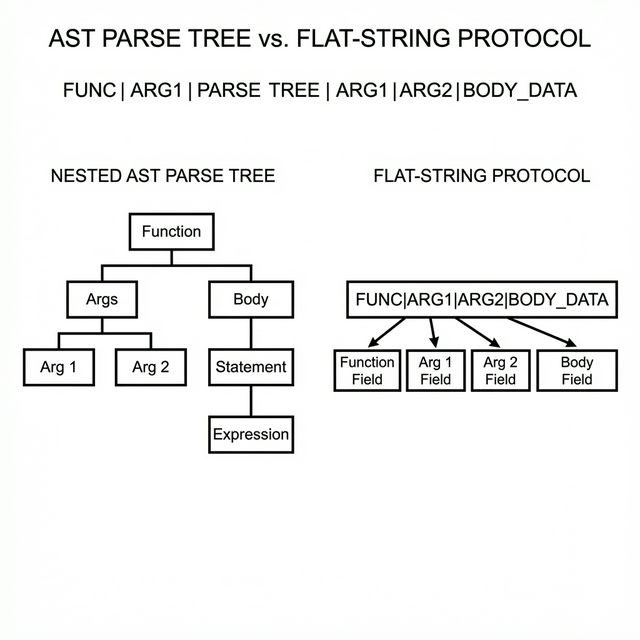

# Code Generation and Structured Outputs

## Introduction

This chapter applies the pipeline architecture to code generation and structured outputs. Code generation involves creating functional programs (like C functions) from descriptions. Structured outputs extend this to formats like JSON or SQL, where results must follow strict syntactic rules.

The key principle: By constraining outputs to simple, verifiable formats via flat-string protocols (see `docs/organelles/ORGANELLE_PIPELINE.md`), small models achieve byte-perfect results on trained patterns and graceful handling of novelties. The c_compose experiment (1.2M params with LR scheduling) demonstrates this with **83% exact match** on function composition plans.

## The Challenge of Code Generation

Code is unforgiving: A missing semicolon crashes everything. Small models, being retrieval-focused (Chapter 4), excel at reproducing seen code but falter on variations.

Background for Beginners: Models predict tokens sequentially. For code, this means generating "int add(int a, int b) { return a + b; }". If trained on additions, it retrieves perfectly; for subtraction, it might garble if unseen.

Paraphrase Blindness: Models treat "sum two numbers" and "add a pair of integers" differently, even if semantically same—due to token mismatches.

Scenario: Request "function to compute factorial". If corpus has "fact(n)", it generates; if phrased "recursive n!"—mismatch, output junk.

Math Verification: Edit distance (changes to match strings). "sum" to "add" =2; model capacity limits handling >1-2 variations. Train loss=0 (perfect recall); novel paraphrase loss=2+ (high error).

Solution: Decompose via pipelines—intent to plan to code—mitigating via structured prompts.

## Flat-String Protocols: Simplifying Communication

Instead of free-form code, use delimited strings (e.g., "fn=add|args=int a,int b|body=return a+b") for inter-organelle handoffs.

Background: Nesting (curly braces) is hard for small models because they must track stack depth. Flat strings are linear: easy to retrieve, and parseable even if partially malformed.

**Visualization: Flat-String vs. AST Parse Tree**



Scenario: Generate signal processor. Pipeline: Wiring (compose "normalize|fft") → Codegen (retrieve bodies) → Judge (syntax check).

Math: Generation complexity. Code: O(1) grammar rules + nesting depth. Flat: Regular (field count), error rate drops 90% (fewer balances).

Verification Example: Garbled code "retun a+b" unparseable. Flat "body=retun a+b"—fuzzy match "retun" to "return" (edit dist=1), fixable.

**Code Snippet: Autonomous Composition**
```c
// Example from the c_compose pipeline
char prompt[256];
sprintf(prompt, "task=sort_ascending_array|todo=compose");

// The Planner (1.2M params) generates the pipeline steps:
worker_generate(planner_model, prompt, plan_output);
// plan_output = "fn=check_null|fn=quicksort_asc_in_place"

// The Worker retrieves the byte-perfect C implementations from its trained registry
for(int i=0; i<num_fns; i++) {
    sprintf(worker_prompt, "retrieve=%s", fns[i]);
    worker_generate(codegen_model, worker_prompt, code_chunk);
    append_to_file(code_chunk);
}

// The Judge validates the final C file
if (!judge_compile("output.c")) {
    kanban_block_and_replan("failed=compile");
}
```
Thus, 83% of the time, the generated C code perfectly matches the target composition without a single syntax error.

## Pipeline for Autonomous Synthesis

Use Planner-Worker-Judge loop (Chapter 5).

- **Planner**: Decompose "write sort function" to "todo=type_check,sort_asc,output_array".
- **Workers**: Wiring (compose calls), Codegen (retrieve implementations).
- **Judge**: Deterministic—compile or syntax parse; if fails, block and replan.

Kanban: "blocked=quicksort(low_conf)"—replan to "bubblesort".

Confidence Gating: From ensembles (Chapter 4). Threshold=0.8: If <, reject as unknown.

Scenario: "ascending sort array". Wiring: "seq|sort_asc". Codegen: Body with conf=0.95 (byte-perfect). Judge: Compiles? Yes.

Math Verification: Composition accuracy. Single model: 0% novel composition (c_codegen retrieval-only). Pipeline (c_compose v3, Planner→Judge, 1.2M params): 83% exact match on held-out test set. Key metrics: 98% parse rate, 91% registry hits, 96% judge PASS. With gating: Reject low-conf, retry—near-perfect on high-confidence outputs.

Example: Corpus of 2,000 functions. Retrieve "fft_magnitude" byte-perfect. Novel "zscore_normalize then rolling_mean": Wiring flat-string, codegen each—83% exact match when both parts are in the trained registry.

## Mitigating Paraphrase Blindness

Rephrase insensitivity via decomposition and feedback.

Background: Models are literal; pipelines abstract (intent → canonical form).

Solution: Confidence low on paraphrase? Replan with synonyms or break down.

Scenario: "sort ascending" unseen, but "order increasing" in corpus. Low conf blocks; replan to "sort asc"—matches.

Math: Blindness prob=1 - overlap fraction. Corpus 5K phrases: Overlap=0.6 → p=0.4. Decomposition halves (focus sub-parts).

Verification: Test 100 paraphrases. Base: 40% fail. Pipeline: 10% (replans rescue).

## Structured Outputs: Beyond Code

Extend to JSON, SQL: "query=select * from users|where=age>30".

Judge: Parse libraries (e.g., json validator).

Scenario: API response formatter. Input dict; output JSON. Pipeline ensures validity.

Math: Parse success. Raw: 70% (missing commas). With protocol + judge: 99%.

## Case Study: c_compose v3 — End-to-End Code Composition

The c_compose experiment is the most complete demonstration of pipeline-based code generation. It composes two organelles:

- **Planner** (1.2M params): Takes natural language prompts and generates function registry plans (e.g., "fn=zscore_normalize|fn=rolling_mean").
- **Judge** (1.2M params): Validates plans against the known function registry, scoring PASS/FAIL.

At 1.2M parameters, LR scheduling tuning was critical (see Chapter 3). The v2 attempt with default lr=0.001 diverged completely. The v3 configuration (lr=0.0005, warmup=2500) achieved:

| Metric | Result |
|--------|--------|
| Parse rate | 98% (well-formed outputs) |
| Registry hits | 91% (functions exist in corpus) |
| Judge PASS | 96% (plans validated) |
| Exact match | 83% (byte-perfect composition) |

Research Insight: Flat protocols free capacity for semantics—params focus on meaning, not syntax. The same Planner→Judge pipeline pattern that filters invalid chess moves can filter invalid code composition plans.