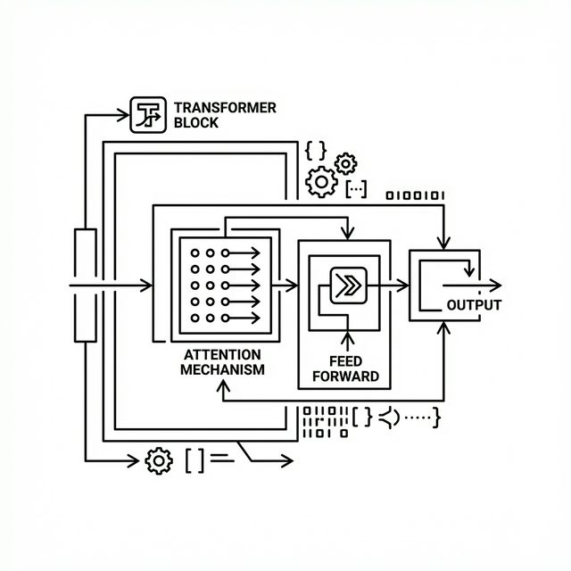

# Core Architecture of MicroGPT-C

## Introduction

Building on the foundation laid in Chapter 1, where we explored the need for small, efficient AI, this chapter delves into the technical heart of MicroGPT-C. We'll dissect its core architecture, which is inspired by the transformer model—a revolutionary design that powers many modern AI systems. For those new to AI, think of the architecture as the blueprint of a building: it defines how data flows through the system, how decisions are made, and how the model learns from experience. MicroGPT-C implements a compact version of this blueprint in pure C99 code, making it accessible and modifiable.

Our goal is to equip you with the knowledge to understand, build, and even tweak your own models. We'll cover key components like tokenization (turning raw data into processable units), the transformer layers (where the "intelligence" emerges), and optimization techniques (how the model improves over time). Along the way, we'll use simple math, code snippets, and scenarios to verify concepts. No prior AI expertise is assumed—we'll explain terms as we go.

To start, recall from Chapter 1 that neural networks are layered structures of nodes that process data. In MicroGPT-C, we focus on generative models: systems that predict the next piece of data in a sequence, like the next word in a sentence or the next move in a game. This predictive power is the basis for generation tasks.

## Tokenization: The First Step in Data Processing

Before any AI model can work with data, it must convert raw input—like text or numbers—into a numerical format that computers can handle. This process is called tokenization. In MicroGPT-C, tokenization is deliberately simple to keep models small and efficient, avoiding complex schemes that add overhead.

For non-specialists, imagine tokenization as breaking a sentence into words or letters, then assigning each a unique ID number. The model learns patterns based on these IDs. MicroGPT-C supports two main approaches: character-level and word-level.

### Character-Level Tokenization

This method treats each individual character (or byte) as a token. It's ideal for short, structured data where spelling and patterns matter, like names or codes.

Example Scenario: Suppose we have the input "cat". Character-level tokenization might map 'c' to ID 1, 'a' to ID 2, 't' to ID 3. We add special tokens like BOS (Beginning of Sequence, say ID 0) to mark starts and ends. The tokenized sequence becomes [0, 1, 2, 3, 0].

To verify, let's think about vocabulary size—the number of unique tokens. For English text, there are about 26 letters plus punctuation, so roughly 50-100 tokens. This small vocabulary means the model doesn't waste capacity learning rare words; it focuses on combinations.

Mathematically, the embedding layer (which we'll cover next) turns each ID into a vector. With a small vocabulary, the output matrix is compact: if embeddings are 32-dimensional, the matrix is 100 rows × 32 columns = 3,200 parameters. Compare to word-level (below), and you see the efficiency.

Pros: No unknown tokens—every character is handled. Cons: Longer sequences for the same text, as "cat" is three tokens instead of one.

### Word-Level Tokenization

Here, we split text on spaces and assign IDs to whole words. This is better for longer prose where semantic meaning (word relationships) is key.

Example: For "the quick brown fox", tokens might be 'the' (ID 1), 'quick' (ID 2), etc. Vocabulary size grows with unique words—say 5,000 for a medium corpus.

Verification with Math: Sequence length shortens (4 tokens vs. 20+ characters), reducing computation in attention (O(n²), where n is length). But larger vocabulary means bigger matrices: 5,000 × 32 = 160,000 parameters.

In code, MicroGPT-C builds a vocabulary by scanning data and ranking frequent words/characters. You can limit it to avoid bloat.

Scenario: Training on recipes. Word-level captures "bake" as one unit, preserving meaning. Character-level might generate nonsense like "b a k e" but handles misspellings better.

Choose based on data: character for <256 chars/document, word for longer text.

## The Transformer Block: Where Patterns Emerge



The core of MicroGPT-C is the transformer block, repeated in layers (typically 1-4 for small models). Each block has two main parts: multi-head attention (focusing on relevant data) and a feed-forward network (processing features).

### Multi-Head Attention

Attention lets the model weigh input parts differently. For example, in "The cat chased the mouse", when predicting after "chased the", it attends more to "cat" than "The".

Background: Attention computes similarities between query (current position), key (past positions), and value (content). 

**Mathematical Formulation:**
\begin{equation}
\text{Attention}(Q, K, V) = \text{softmax}\left(\frac{QK^T}{\sqrt{d_k}}\right)V
\end{equation}
Where $Q, K, V$ are matrices derived from the input, and $d_k$ is the dimension of the keys. The $\sqrt{d_k}$ scaling prevents the dot products from growing too large, which would push the softmax function into regions with extremely small gradients.

The softmax function turns raw scores into probabilities summing to $1$:
\begin{equation}
\text{softmax}(x_i) = \frac{e^{x_i}}{\sum_{j=1}^n e^{x_j}}
\end{equation}

Multi-head means running this parallelly across different "heads", each learning different representational patterns, then concatenating the results.

Verification Example: Suppose input vectors: Position 1: [1, 0], Position 2: [0, 1]. Q1 = [1, 0], K1 = [1, 0], K2 = [0, 1]. Scores: Q1·K1 = 1, Q1·K2 = 0. After softmax: [1, 0]. Output attends fully to position 1.

In MicroGPT-C, we use causal masking: future positions are ignored (masked with -infinity before softmax), ensuring predictions use only past data.

Variants for Efficiency:

- Grouped Query Attention (GQA): Shares keys/values across query heads, reducing memory by 2-4x with little quality loss. Like students sharing notes.
- Sliding Window Attention (SWA): Limits attention to recent tokens, cutting computation for long sequences.

These keep models small—GQA halves KV cache (stored past keys/values) size.

### Feed-Forward Network and Normalization

After attention, a simple neural network (two linear layers) refines features. The first layer expands the dimension to $4 \times d_{model}$, an activation function induces non-linearity, and the second layer projects back down.

By default, MicroGPT-C uses ReLU (Rectified Linear Unit): `max(0, x)`. 

> **Hacker Challenge 2.1: Swap ReLU for GELU**
> ReLU is fast but can cause "dead neurons". GELU (Gaussian Error Linear Unit) is smoother.
> 1. Open `src/microgpt.c` and locate the `forward_backward_one` function.
> 2. Find the ReLU activation step.
> 3. Swap it for a GELU approximation: `x = 0.5 * x * (1 + tanh(sqrt(2/PI) * (x + 0.044715 * x^3)))`.
> 4. Train a small model on the `names` corpus. Measure the loss delta. Does the model converge faster?

Normalization (RMSNorm: divide by root-mean-square) stabilizes training: 
\begin{equation}
\text{RMSNorm}(x) = \frac{x}{\sqrt{\frac{1}{d}\sum_{i=1}^d x_i^2 + \epsilon}}
\end{equation}

MicroGPT-C uses **pre-normalization** (GPT-2 style): RMSNorm is applied *before* attention and *before* the MLP. Residual connections add the bypassed input to the output, easing gradient flow.

Scenario: In name generation, attention links prefixes ("Al" attends to "ex" in training), feed-forward adds creativity.

## Optimization: Learning from Data

Training adjusts parameters to minimize loss (error measure, like cross-entropy: -sum(target * log(predicted))).

Adam Optimizer: Adaptive learning rates. Steps: Compute gradients (error derivatives), update with momentum (average past gradients) and variance (scale by volatility).

Formula: m = β1 * m + (1-β1) * g; v = β2 * v + (1-β2) * g²; param -= lr * m / (sqrt(v) + ε)

With warmup (gradual lr increase) and cosine decay (lr decreases smoothly).

Verification: On toy data [1,2,3] predicting [2,3,4], loss starts high (~1.0), drops to ~0.01 after steps, model predicts accurately.

KV Caching speeds inference: Store past computations, append only new.

## Putting It Together: Model Creation and Flow

In MicroGPT-C (see `src/microgpt.h` and `src/microgpt.c`), the forward pass meticulously executes the equations described above. Here is a simplified code snippet of the core forward loop:

```c
// Simplified excerpt from microgpt.c
for (int l = 0; l < cfg->n_layers; l++) {
    // 1. Pre-normalization for Attention
    rmsnorm(x_norm1, x, weight_norm1, cfg->d_model);
    
    // 2. Linear projections for Q, K, V
    matmul(q, x_norm1, w_q, cfg->d_model, cfg->d_model);
    matmul(k, x_norm1, w_k, cfg->d_model, cfg->d_model);
    matmul(v, x_norm1, w_v, cfg->d_model, cfg->d_model);
    
    // 3. Attention calculation...
    // score = (q @ k.T) / sqrt(d_k)
    // weights = softmax(score + mask)
    // out = weights @ v
    
    // 4. Residual Connection
    add_residual(x, attention_out, cfg->d_model);
    
    // 5. Pre-normalization for Feed-Forward
    rmsnorm(x_norm2, x, weight_norm2, cfg->d_model);
    
    // 6. Feed-Forward with ReLU
    matmul(ff_hidden, x_norm2, w_fc, cfg->d_model, cfg->d_model * 4);
    relu(ff_hidden, cfg->d_model * 4); // <--- Swap to GELU here for the challenge!
    matmul(ff_out, ff_hidden, w_proj, cfg->d_model * 4, cfg->d_model);
    
    // 7. Residual Connection
    add_residual(x, ff_out, cfg->d_model);
}
```

This clear, linear progression makes it trivial to hack, profile, and optimize for edge devices.