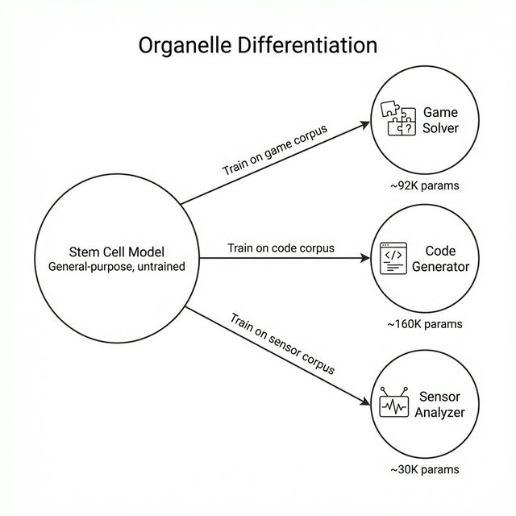

# Training and Inference Fundamentals



## Introduction

With MicroGPT-C's architecture in place (Chapter 2), we now turn to the dynamic aspects: training and inference. Training is where the model learns from data, adjusting its parameters to make better predictions. Inference is where the trained model generates outputs based on new inputs.

This chapter covers training loops, learning rate scheduling, optimization with Adam, KV caching for efficient inference, and techniques for reproducibility. By the end, you'll understand how to train a model from scratch and deploy it for practical use on edge devices.

## The Training Loop: Learning from Data

Training in MicroGPT-C follows a straightforward loop: feed data, compute errors, adjust parameters, and repeat. The goal is to minimize "loss"—a numerical measure of how wrong the model's predictions are.

Here is the general pseudocode for a MicroGPT-C training step:
```c
// 1. Fetch a batch of tokens (inputs) and targets (shifted by 1)
get_batch(data, &inputs, &targets, batch_size, seq_len);

// 2. Forward pass: compute logits and loss
forward_backward_one(model, inputs, targets, &loss); 

// 3. Update parameters using gradients
adam_step(model, learning_rate);

// 4. Zero the gradients for the next step
zero_grad(model);
```

### Loss Function: Measuring Errors

The primary loss in generative models like MicroGPT-C is cross-entropy, which quantifies the difference between predicted probabilities and actual targets.

**Mathematical Formulation:**
\begin{equation}
\text{Loss} = -\sum_{i=1}^{V} y_i \log(\hat{y}_i)
\end{equation}
Where $V$ is the vocabulary size, $y_i$ is the target distribution (1 for the correct token, 0 otherwise), and $\hat{y}_i$ is the predicted probability. For the single correct token $c$, this simplifies to:
\begin{equation}
\text{Loss} = -\log(\hat{y}_c)
\end{equation}

Verification Example: Train on "hello". Tokenized as [h,e,l,l,o]. Model predicts after "hell" should be 'o' (prob 0.01 initially, loss high: $-\log(0.01) \approx 4.6$). After training, prob=0.99, loss low ($-\log(0.99) \approx 0.01$).

Scenario: Building a password strength checker. Train on strong/weak examples. High loss on weak passwords encourages the model to flag patterns like "1234".

### Batches and Epochs

Data is processed in batches (e.g., 32 examples) to balance speed and accuracy. An epoch is one full pass through the dataset.

Math Verification: Gradient descent (parameter update) is more stable with batches. Variance in single-example gradients is high; averaging reduces noise. If dataset has 1,000 examples, batch size 100 means 10 updates per epoch.

In MicroGPT-C, multi-threading splits batches across CPU cores, speeding training on laptops.

## Optimization: Adjusting Parameters Efficiently

Optimization uses gradients (derivatives showing how to reduce loss) to update parameters.

### Adam Optimizer

MicroGPT-C uses Adam, which adapts learning rates per parameter.

Background: Basic gradient descent updates parameters directly from the gradient. Adam adds *momentum* (smoothing updates using past gradients) and *adaptive scaling* (taking larger steps for stable parameters, smaller steps for volatile ones).

**Mathematical Formulation:**
For a parameter $\theta$ with gradient $g$:

1. Update biased first moment estimate:
\begin{equation}
   m_t = \beta_1 m_{t-1} + (1 - \beta_1) g_t
\end{equation}

2. Update biased second raw moment estimate:
\begin{equation}
   v_t = \beta_2 v_{t-1} + (1 - \beta_2) g_t^2
\end{equation}

3. Update parameter (simplified, absorbing bias correction into learning rate $\alpha$):
\begin{equation}
   \theta_t = \theta_{t-1} - \frac{\alpha m_t}{\sqrt{v_t} + \epsilon}
\end{equation}

(MicroGPT-C uses default hyperparameters: $\beta_1=0.85$, $\beta_2=0.99$, $\epsilon=1e-8$).

This prevents overshooting in noisy gradients, common when training on small datasets.

Verification with Toy Math: Gradient $g=1.0$, initial $m=v=0$. After one step: $m=0.15, v=0.01$, update $\approx \alpha \cdot \frac{0.15}{0.1} = 1.5 \alpha$. If the next step has a smaller gradient $g=0.5$, Adam maintains momentum but adapts the variance scaling seamlessly.

### Learning Rate Scheduling

Raw learning rates can cause divergence (exploding loss). MicroGPT-C uses warmup (start low, ramp up) and cosine decay (smooth decrease).

**Warmup formula:**
\begin{equation}
lr = \text{base\_lr} \times \min\left(1, \frac{\text{step}}{\text{warmup\_steps}}\right)
\end{equation}

**Cosine decay formula:**
\begin{equation}
lr = \text{base\_lr} \times 0.5 \times \left(1 + \cos\left(\pi \frac{\text{step} - \text{warmup}}{\text{total} - \text{warmup}}\right)\right)
\end{equation}

Why? Early steps need caution because moments in Adam haven't stabilized; later steps need fine-tuning to settle into a minimum.

When tracking metrics during training, the most crucial indicator of genuine learning is how the loss smoothly converges over time. If the loss oscillates near its starting value, the model is failing to find a minimum. MicroGPT-C logs cross-entropy loss metrics periodically so they can be parsed to confirm that optimization is actively taking place.

### Case Study: Stabilising 1.2M Parameters (c_compose v3)

The c_compose experiment (Chapter 10) demonstrates why LR scheduling tuning matters as models scale.

| Setting | lr | warmup | Result |
|---------|------|--------|--------|
| v2 (default) | 0.001 | 100 | **Diverged** — loss exploded, 20% parse rate, 0% exact match |
| v3 (tuned) | 0.0005 | 2500 | **Stable** — 98% parse, 83% exact match, 96% judge PASS |

Two changes made the difference:

- **Halved peak lr** (0.001→0.0005): Larger models have more parameters competing for gradient signal; smaller steps prevent overshooting.
- **25× longer warmup** (100→2500, 5% of 50K steps): Gives Adam's moment estimates time to stabilise before full-strength updates.

The LR-Capacity Scaling Rule: As detailed in Chapter 3, peak learning rate must decrease as parameters increase ($lr \propto 1/\sqrt{params}$), with warmup taking $\sim 5\%$ of total steps.

## The Proof: Do Organelles Actually Learn?

A fundamental question arises when deploying tiny models with rigid pipelines: is the model providing real intelligence, or is the pipeline simply filtering random noise into successful outcomes?

To answer this, an Intelligence Testing Leaderboard experiment evaluated trained organelles against a random baseline (where the model outputs uniformly random valid guesses, but the pipeline still operates). For the puzzle game *Mastermind* (a search space of 1,296 possible codes), random guessing has a near-0% solve rate. 

**Results:**
- **Random Baseline:** 0% solved.
- **Trained Model:** 78% solved (with 92% of moves parsed as perfectly valid without pipeline fallback).
  
Similarly, for *Connect-4*, the trained model won 91% of games compared to 54% for the random baseline, representing a 37-point intelligence gap. The pipeline acts merely as a safety net for the 3–8% of residual errors. The models genuinely learn the task-relevant patterns from their corpora.

## Parameter Right-Sizing: Less Is More
Before exploring complex ensemble techniques, the single most impactful optimization is right-sizing the model's capacity to the corpus. An experiment scaling 8 different domains revealed that a uniform 460K-parameter config was over-provisioned for small corpora (e.g., fewer than 5,000 examples). 

Using three curated tiers, models improved when significantly smaller:
- **Micro (~30K params):** Best for <500 examples.
- **Small (~92K params):** Best for 1K-5K examples.
- **Standard (~160K params):** Best for 5K+ examples.

Right-sizing yielded up to 93% smaller models that trained up to 10× faster without performance loss, proving that over-parameterization actively harms learning on edge-constrained tasks by inducing noise memorization instead of pattern recognition.

## Ensemble Voting: Boosting Reliability

## Inference: Generating Outputs

Inference reuses the forward pass but samples from probabilities instead of computing loss.

### Sampling Techniques

- Greedy: Pick max probability (deterministic, repetitive).
- Temperature: Scale logits before softmax. Temp=0: greedy; Temp=1: original; Temp>1: more random.

Formula: logits / temp → softmax.

Verification: Logits [2,1,0] at temp=1: probs [0.665,0.245,0.09]. At temp=0.5: sharper [0.88,0.106,0.014]—less random.

Top-k: Sample from top k probs. Nucleus (top-p): From cumulative probs until sum>p.

Scenario: Story generator. High temp for creativity ("The dragon flew to Mars"); low for consistency.

### KV Caching for Efficiency

In sequences, recompute past attention each time? No—cache keys/values, append new.

Background: For position t, attention uses keys/values up to t-1.

Math: Without cache, time O(t²) per generation; with, O(t) total.

Paged KV: For long sequences, allocate in pages to avoid fragmentation.

Example: Chatbot. Cache conversation history; add user input, generate response quickly.

## Reproducibility and Overfitting

Seed random number generators for same results across runs.

Overfitting: Model memorizes training data, fails on new. Detect: Train loss low, test loss high.

Scenario: Train on 10 names, generates perfectly—but on unseen, garbage. Solution: More data, regularization (e.g., dropout: randomly ignore nodes).

Math: Compute perplexity = exp(loss). Low=good prediction. Overfit: Train perplexity=1 (perfect), test=10 (poor).

## Handling Catastrophic Forgetting

Incremental training erases old knowledge. Mitigate with replay buffers (mix old/new data).

Verification: Train on set A (loss=0.1), then B (A loss rises to 1.0). With replay, A loss stays low.