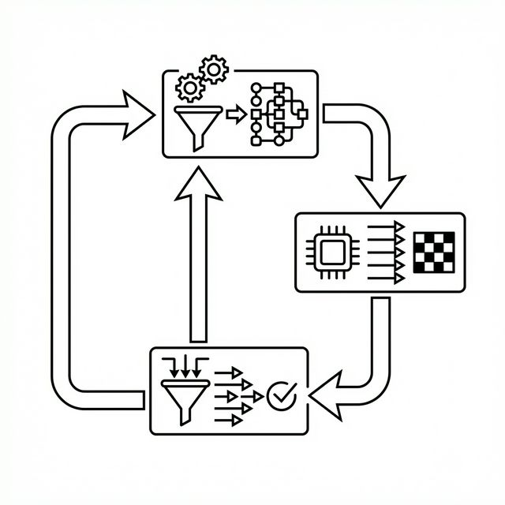

# Pipeline Coordination – The Kanban Architecture

## Introduction

With specialized organelles established (Chapter 4), the critical challenge is: how do these individual specialists collaborate to solve problems that none could tackle alone? This chapter introduces the Pipeline Coordination framework, inspired by Kanban—a workflow management system using stages like "to do," "in progress," and "done."

The Organelle Pipeline Architecture (OPA) orchestrates multiple organelles into a coordinated pipeline via the API in `src/microgpt_organelle.h`. Each organelle contributes its expertise while a shared Kanban state ensures smooth handoffs and error recovery. The key insight: pipeline coordination turns weak individual models (e.g., 50% accurate) into robust systems (90%+ success) via structured interaction.

## The Organelle Pipeline: Breaking Down Complex Tasks



A pipeline is a sequence of organelles connected by a simple communication protocol—flat strings separated by pipes (e.g., "board=state|move=up"). This avoids complex nesting, reducing errors in small models.

Background for Beginners: Complex tasks often require steps: analyze, propose, validate, adapt. A single model struggles with all; pipelines assign each to a specialist.

Components:

- **Planner**: Decomposes the problem into tasks (e.g., "todo=check_threat,move_center").
- **Workers**: Execute tasks (e.g., a "mover" organelle suggests "left").
- **Judge**: Validates deterministically (e.g., check if move is legal).
- **Loop**: Repeat with feedback until solved.

Scenario: Solving a sliding puzzle (tiles 1-8, blank space). Planner: "todo=prioritize_misplaced_tile,move". Worker: "down". Judge: Apply move, check if closer to goal. If invalid, feedback loops back.

Verification with Math: Error rate. Single organelle: p_invalid=0.5 (50% bad moves). Pipeline with judge: Rejects invalids, effective rate=0. Pipeline success = (1 - p)^steps, but with replans, approaches 1.

Verification with Math: Error rate. Single organelle: p_invalid=0.5 (50% bad moves). Pipeline with judge: Rejects invalids, effective rate=0. Pipeline success = (1 - p)^steps, but with replans, approaches 1.

In code, pipelines use string prompts: Prompt Worker with Planner's output + state.
## Kanban State: The Shared Coordination Mechanism

Kanban uses a string to track state: "todo=..." (tasks), "blocked=..." (failures), "last=..." (history), stalls (retry count).

Background: In manufacturing, Kanban cards signal needs. Here, it prevents repetition and enables adaptation.

Mechanics:

- **Todo List**: Planner generates sequenced tasks.
- **Blocked Actions**: Log invalids (e.g., "blocked=up,down") to avoid retries.
- **History**: Recent moves to detect patterns.
- **Stalls**: Count unchanged progress; trigger replan if >3.

Example String: "board=123746058|todo=move_down,check|blocked=left|last=up,down|stalls=2"

Scenario: Chess-like game. Model suggests illegal move ("blocked=knight_to_occupied"). Kanban adds to prompt; next suggestion avoids it.

Math Verification: Oscillation probability. Without history: P(repeat bad cycle)=0.5^2=0.25 for A-B-A. With Kanban history (window=4): Detects after 3, forces alternative, P drops to <0.05.

Code Snippet: Here is a closer look at how Kanban state is managed in `src/microgpt_organelle.c`:
```c
// Simplified excerpt showing OpaKanban mechanics
typedef struct {
    char blocked_actions[MAX_BLOCKED][MAX_TOKEN_LEN];
    int blocked_count;
    char move_history[MAX_HISTORY][MAX_TOKEN_LEN];
    int history_count;
    int stalls;
} OpaKanban;

void kanban_update_prompt(OpaKanban *kb, char *base_prompt) {
    if (kb->blocked_count > 0) {
        strcat(base_prompt, "|blocked=");
        for (int i = 0; i < kb->blocked_count; i++) {
            strcat(base_prompt, kb->blocked_actions[i]);
            if (i < kb->blocked_count - 1) strcat(base_prompt, ",");
        }
    }
    if (kb->stalls > 3) {
        strcat(base_prompt, "|trap=1"); // Trigger alternative planning
    }
}
```

This "safety net" turns blind guesses into winners, securely funneling 50% invalid raw generations into structurally sound, 90%+ success rate pipelines.

## Cycle Detection and Replanning: Breaking Loops

Cycles (e.g., alternating invalid moves) waste cycles; detection breaks them.

Background: Like spotting a loop in navigation, record recent actions; if next matches a pattern, intervene.

Algorithm: Window of last k=4 actions. If next forms A-B-A-B, force unexplored option.

Scenario: Puzzle stuck sliding tile back-forth. Detection: Record "left,right,left"; next "right" triggers fallback to "up".

Math: Detection rate. For cycle length 2, prob miss in window 4: (1 - 1/2^4)=0.9375 miss? No—check pairs: If last= A,B,A, next=B → detect. Effective for short cycles common in small models.

Verification Example: Simulate 100 runs. Without: 20% stuck. With: 2% (forces branch).

Replanning: If stalls high, rerun Planner with updated Kanban (e.g., "trap=1" flag for alternatives).

## Case Studies: Games as Coordination Labs

Games test pipelines: fixed rules, clear metrics.

### 8-Puzzle: Sequential Planning

9-tile grid, slide to order. Pipeline: Strategist (priority tile), Detector (greedy vs. detour), Mover, Judge.

Kanban rescues: Blocks invalids, breaks cycles (73 in tests), solves 90% (100% easy, 70% hard).

Scenario: Stuck in local minimum (suboptimal path). Detour flag + replan escapes.

### Tic-Tac-Toe: Adversarial Threats

3x3 grid, win by line. Pipeline: Planner (todo=block,win), Player (move), Judge.

Zero invalids via filtering; 87% win+draw vs. random.

Math: Invalid rate 50% single → 0% pipeline. Wins: Coordination spots forks.

### Connect-4: Deeper Strategy

7x6 grid, connect four. Similar pipeline: 88% wins, 0 invalids despite 50% raw.

Scenario: Column full (invalid drop). Kanban blocks, replans to open column.

These verify: Pipeline boosts weak models (coin-flip to dominant).

### Beyond Games: C Code Composition (c_compose)

The pipeline pattern extends beyond games. The c_compose experiment applies the same Planner→Judge architecture to autonomous code composition:

- **Planner organelle** (1.2M params): Given a natural language prompt, generates a function registry plan (e.g., "fn=zscore_normalize|fn=rolling_mean").
- **Judge organelle** (1.2M params): Validates the plan against a known function registry, scoring PASS/FAIL.

At 1.2M parameters—2.6× the game organelles—LR scheduling tuning was critical (see Chapter 3). With the corrected schedule (lr=0.0005, warmup=2500):

| Metric | Result |
|--------|--------|
| Parse rate | 98% |
| Registry hits | 91% |
| Judge PASS | 96% |
| Exact match | 83% |

This demonstrates that the Kanban pipeline pattern generalises from games to structured text generation. The same coordination that filters invalid chess moves can filter invalid code composition plans.

## End-to-End Research: From Weakness to Strength

Research shows pipelines scale: Capacity up reduces parses (91% drop); Kanban handles rest. Hypothesis: Any decomposable task benefits.

Verification: Metrics—solve rate, replans/game. In games: 90% avg, proving coordination.